# Database ER Diagram & Schema Specification

This document provides a comprehensive blueprint of the PostgreSQL database schema powered by Sequelize ORM for the School Management ERP application.

---

## 1. High-Level Entity Relationship Diagram (Mermaid)

```mermaid
erDiagram
    SCHOOLS ||--o{ USERS : "has members"
    SCHOOLS ||--o{ ACADEMIC_YEARS : "defines"
    SCHOOLS ||--o{ CLASSES : "has"
    SCHOOLS ||--o{ SUBJECTS : "teaches"
    SUBJECTS ||--o{ CLASS_SUBJECTS : "mapped to"
    CLASSES ||--o{ CLASS_SUBJECTS : "default pool"
    SUBJECTS ||--o{ SECTION_SUBJECT_OVERRIDES : "overridden in"
    CLASSES ||--o{ SECTION_SUBJECT_OVERRIDES : "for class"
    SECTIONS ||--o{ SECTION_SUBJECT_OVERRIDES : "per section"

    USERS ||--o| TEACHERS : "profile"
    USERS ||--o| STUDENTS : "profile"
    USERS ||--o| DRIVERS : "profile"

    CLASSES ||--o{ SECTIONS : "contains"
    CLASSES ||--o{ TEACHER_ASSIGNMENTS : "assigned to"
    SECTIONS ||--o{ TEACHER_ASSIGNMENTS : "assigned to"
    TEACHERS ||--o{ TEACHER_ASSIGNMENTS : "teaches"
    SUBJECTS ||--o{ TEACHER_ASSIGNMENTS : "in subject"

    STUDENTS ||--o{ STUDENT_ENROLLMENTS : "enrolled in"
    ACADEMIC_YEARS ||--o{ STUDENT_ENROLLMENTS : "during year"
    CLASSES ||--o{ STUDENT_ENROLLMENTS : "in class"

    STUDENTS ||--o{ ATTENDANCES : "records"
    TEACHER_ASSIGNMENTS ||--o{ TIMETABLES : "scheduled"

    EXAM_MASTERS ||--o{ EXAMS : "template for"
    EXAMS ||--o{ EXAM_SUBJECTS : "includes"
    EXAM_SUBJECTS ||--o{ EXAM_MARKS : "scores"
    STUDENTS ||--o{ EXAM_MARKS : "receives"

    STUDENTS ||--o{ STUDENT_FEES : "billed"
    FEE_DEFINITIONS ||--o{ STUDENT_FEES : "defined by"
    STUDENT_FEES ||--o{ FEE_PAYMENTS : "paid via"

    TEACHERS ||--o{ BOOK_ISSUES : "borrows"
    STUDENTS ||--o{ BOOK_ISSUES : "borrows"
    BOOKS ||--o{ BOOK_ISSUES : "copies issued"

    DRIVERS ||--o{ TRIPS : "drives"
    VEHICLES ||--o{ TRIPS : "used in"
    TRIPS ||--o{ TRIP_LOCATIONS : "tracks GPS"

    USERS ||--o{ TOKEN_ACCOUNTS : "owns balance"
    USERS ||--o{ TOKEN_TRANSACTIONS : "transacts"

    USERS ||--o{ STUDENT_CHAT_SESSIONS : "chats"
    STUDENT_CHAT_SESSIONS ||--o{ STUDENT_CHAT_MESSAGES : "messages"
```

---

## 2. Detailed Table Schemas

### Core Multi-Tenant & Identity

#### `schools`
Central multi-tenant organizational entity.
- `id` (BIGINT, PK, Auto-Increment)
- `school_name` (STRING, Non-Null)
- `board` (STRING, Default: 'CBSE')
- `address` (TEXT), `city` (STRING), `state` (STRING), `zip` (STRING)
- `contact_phone` (STRING), `email` (STRING, Unique)
- `logo_url` (TEXT)
- `status` (ENUM: 'pending', 'active', 'suspended', 'expired')
- `whatsapp_annual_limit` (INTEGER), `whatsapp_sent_count` (INTEGER)
- `google_maps_enabled` (BOOLEAN), `promotion_wizard_enabled` (BOOLEAN)
- `risk_attendance_cutoff` (INT), `risk_academic_cutoff` (INT), `risk_grade_drop_margin` (INT)
- `library_loan_period_days` (INT), `library_overdue_fine_per_day` (DECIMAL(10,2))
- `fee_receipt_counter` (INT)
- `enabled_modules` (JSONB, Non-Null, Default: `{"transport":true,"library":true,"finance":true,"ai_tutor":true,"ai_tools":true,"ai_video":true,"whatsapp":true}`)

#### `users`
System-wide credential and auth profile entity.
- `id` (BIGINT, PK, Auto-Increment)
- `school_id` (BIGINT, FK -> `schools.id`, Null for `super_admin`)
- `role` (ENUM: 'super_admin', 'school_admin', 'teacher', 'student', 'driver')
- `username` (STRING, Non-Null)
- `name` (STRING, Non-Null)
- `email` (STRING, Unique), `phone` (STRING)
- `password` (STRING(100), Non-Null)
- `first_login` (BOOLEAN, Default: true)
- `is_active` (BOOLEAN, Default: true)
- `avatar_url` (TEXT)
- `last_login` (DATE)
- *Indexes*: `[school_id]`, `[role]`, `[phone]`, Unique `[school_id, username]`

#### `refresh_tokens`
Multi-device JWT refresh token store.
- `id` (BIGINT, PK, Auto-Increment)
- `user_id` (BIGINT, FK -> `users.id`, Non-Null, On Delete CASCADE)
- `token` (TEXT, Non-Null)
- `device_info` (TEXT, Nullable)
- `expires_at` (DATE, Nullable)
- `created_at` (TIMESTAMP), `updated_at` (TIMESTAMP)
- *Indexes*: `[user_id]`, `[token]`

#### `academic_years`
- `id` (BIGINT, PK)
- `school_id` (BIGINT, FK -> `schools.id`)
- `name` (STRING), `start_date` (DATEONLY), `end_date` (DATEONLY)
- `is_current` (BOOLEAN)
- *Indexes*: Unique `[school_id, name]`

---

### Academic Structure & Profiles

#### `classes`
- `id` (BIGINT, PK)
- `school_id` (BIGINT, FK -> `schools.id`)
- `class_name` (STRING)
- `class_teacher_id` (BIGINT, FK -> `teachers.id`, Nullable)
- `bell_schedule_template_id` (BIGINT, FK -> `bell_schedule_templates.id`, Nullable)
- `is_active` (BOOLEAN)

#### `sections`
- `id` (BIGINT, PK)
- `school_id` (BIGINT, FK -> `schools.id`)
- `class_id` (BIGINT, FK -> `classes.id`)
- `class_teacher_id` (BIGINT, FK -> `teachers.id`, Nullable)
- `name` (STRING(10))
- `is_active` (BOOLEAN)

#### `subjects`
- `id` (BIGINT, PK)
- `school_id` (BIGINT, FK -> `schools.id`)
- `name` (STRING), `code` (STRING)
- `category` (ENUM: 'theory', 'practical', 'both')
- `subject_type` (ENUM: 'academic', 'co_curricular', Default: 'academic')

#### `class_subjects`
Default subject pool for a class. All sections in the class study these subjects unless a `section_subject_overrides` row says otherwise.
- `id` (BIGINT, PK)
- `school_id` (BIGINT, FK -> `schools.id`, CASCADE)
- `class_id` (BIGINT, FK -> `classes.id`, CASCADE)
- `subject_id` (BIGINT, FK -> `subjects.id`, CASCADE)
- `periods_per_week` (INTEGER, Nullable, Default: null)
- `is_active` (BOOLEAN, Default: true)
- Unique: `(school_id, class_id, subject_id)`

#### `section_subject_overrides`
Per-section subject overrides — only populated for sections that differ from the class default (e.g. stream splits). Empty = section uses class default.
- `id` (BIGINT, PK)
- `school_id` (BIGINT, FK -> `schools.id`, CASCADE)
- `class_id` (BIGINT, FK -> `classes.id`, CASCADE)
- `section_id` (BIGINT, FK -> `sections.id`, CASCADE)
- `subject_id` (BIGINT, FK -> `subjects.id`, CASCADE)
- `is_included` (BOOLEAN, Non-Null) — `true` = force include; `false` = force exclude from class default
- `periods_per_week` (INTEGER, Nullable, Default: null) — overrides `class_subjects.periods_per_week` if set
- Unique: `(school_id, class_id, section_id, subject_id)`
- **Resolution**: `getSubjectsForSection(school_id, class_id, section_id)` applies overrides over class default for both inclusion and `periods_per_week`

#### `teachers`
- `id` (BIGINT, PK)
- `user_id` (BIGINT, FK -> `users.id`, Unique)
- `school_id` (BIGINT, FK -> `schools.id`)
- `employee_id` (STRING)
- `gender` (ENUM), `designation` (STRING), `qualification` (STRING)
- `joining_date` (DATEONLY), `experience` (INTEGER)
- `max_periods_per_week` (INTEGER, Nullable) — capacity limit for workload collision checks
- `approval_status` (ENUM: 'pending', 'approved', 'rejected')
- `is_active` (BOOLEAN)
- `status` (ENUM: 'ACTIVE', 'RESIGNED', 'RETIRED', 'TERMINATED')

#### `students`
- `id` (BIGINT, PK)
- `user_id` (BIGINT, FK -> `users.id`, Unique)
- `school_id` (BIGINT, FK -> `schools.id`)
- `class_id` (BIGINT, FK -> `classes.id`), `section_id` (BIGINT, FK -> `sections.id`)
- `roll_no` (INT), `admission_no` (STRING)
- `dob` (DATEONLY), `gender` (ENUM), `blood_group` (STRING), `aadhar_no` (STRING, Unique)
- `father_name` (STRING), `mother_name` (STRING), `guardian_name` (STRING)
- `residential_status` (ENUM: 'dayscholar', 'hosteler')
- `is_active` (BOOLEAN)
- `status` (ENUM: 'ACTIVE', 'TRANSFERRED', 'DROPPED', 'GRADUATED')
- `approval_status` (ENUM: 'pending', 'approved', 'rejected')

#### `student_enrollments`
Tracks historical academic class/section placements by year.
- `id` (BIGINT, PK)
- `student_id` (BIGINT, FK -> `students.id`)
- `academic_year_id` (BIGINT, FK -> `academic_years.id`)
- `class_id` (BIGINT, FK -> `classes.id`), `section_id` (BIGINT, FK -> `sections.id`)
- `roll_no` (INT)
- *Indexes*: Unique `[student_id, academic_year_id]`

#### `teacher_assignments`
Maps teachers to specific Class + Section + Subject combinations.
- `id` (BIGINT, PK)
- `school_id` (BIGINT, FK)
- `teacher_id` (BIGINT, FK -> `teachers.id`, Nullable for co-curricular)
- `class_id` (BIGINT, FK), `section_id` (BIGINT, FK), `subject_id` (BIGINT, FK)
- `is_active` (BOOLEAN), `is_class_teacher` (BOOLEAN)

---

### Attendance & Timetable

#### `attendances`
- `id` (BIGINT, PK)
- `school_id` (BIGINT, FK), `academic_year_id` (BIGINT, FK)
- `class_id` (BIGINT, FK), `section_id` (BIGINT, FK), `student_id` (BIGINT, FK)
- `date` (DATEONLY)
- `status` (ENUM: 'present', 'absent', 'leave', 'on_duty')
- `marked_by` (BIGINT, FK -> `users.id`)
- *Indexes*: Unique `[student_id, date]`

#### `timetables`
- `id` (BIGINT, PK)
- `school_id` (BIGINT, FK), `class_id` (BIGINT, FK), `section_id` (BIGINT, FK)
- `day_of_week` (ENUM: 'monday'..'saturday')
- `start_time` (TIME), `end_time` (TIME)
- `teacher_assignment_id` (BIGINT, FK, Nullable for break)
- `title` (STRING), `is_break` (BOOLEAN)

#### `timetable_substitutions`
- `id` (BIGINT, PK)
- `school_id` (BIGINT, FK), `timetable_id` (BIGINT, FK)
- `date` (DATEONLY)
- `class_id` (BIGINT, FK), `section_id` (BIGINT, FK)
- `original_teacher_id` (BIGINT, FK -> `teachers.id`), `substitute_teacher_id` (BIGINT, FK -> `teachers.id`)

#### `bell_schedule_templates`
- `id` (BIGINT, PK)
- `school_id` (BIGINT, FK -> `schools.id`, CASCADE)
- `name` (STRING)
- `working_days_per_week` (INTEGER, Default: 6)

#### `bell_schedule_periods`
- `id` (BIGINT, PK)
- `template_id` (BIGINT, FK -> `bell_schedule_templates.id`, CASCADE)
- `order_index` (INTEGER)
- `start_time` (STRING), `end_time` (STRING)
- `is_break` (BOOLEAN, Default: false)
- `title` (STRING, Nullable)

#### `timetable_generation_jobs`
- `id` (BIGINT, PK)
- `school_id` (BIGINT, FK -> `schools.id`, CASCADE)
- `academic_year_id` (BIGINT, FK -> `academic_years.id`, CASCADE)
- `status` (ENUM: 'pending', 'processing', 'completed', 'failed')
- `triggered_by` (BIGINT, FK -> `users.id`, Nullable)
- `result_summary` (JSONB)
- `completed_at` (DATE, Nullable)

---

### Exams, Marks & Fees

#### `exam_masters`, `exams`, `exam_subjects`, `exam_marks`, `grading_scales`
- `exam_masters`: Institution-wide standardized exam templates.
- `exams`: Specific exam term instances for a class (and optional section stream). Columns: `id`, `school_id`, `academic_year_id`, `class_id`, `section_id` (Nullable FK -> `sections.id`), `name`, `exam_master_id`, `is_locked`.
- `exam_subjects`: Max marks & syllabus for each subject in an exam.
- `exam_marks`: Score per student, subject, and exam. Unique `[exam_id, subject_id, student_id]`.
- `grading_scales`: Grade boundaries (e.g. 'A+', min percentage: 90, color_code).

#### `fee_categories`, `fee_definitions`, `student_fees`, `fee_payments`
- `fee_categories`: Structuring types (Tuition, Transport, Sports).
- `fee_definitions`: Fee structure defined for a class/year.
- `student_fees`: Ledger per student tracking total, concessions, paid, and balance.
- `fee_payments`: Individual transaction receipts with mode, reference, and void tracking.

---

### Transport & Live GPS

#### `drivers`, `vehicles`, `student_transports`, `trips`, `trip_locations`, `transport_requests`
- `drivers`: License & profile linked to user.
- `vehicles`: Bus registration, capacity, assigned driver.
- `student_transports`: Student bus allocation & pickup point.
- `trips`: Live trip tracking sessions ('pickup' / 'drop').
- `trip_locations`: High-frequency GPS coordinates (lat, long, speed, heading).
- `transport_requests`: Change/assignment requests by parents/students.

---

### AI, Gamification & RAG Learning

#### `quizzes`, `quiz_questions`, `teacher_quizzes`, `teacher_quiz_questions`, `student_quiz_submissions`
- AI-generated dynamic quizzes and teacher-curated assessments.

#### `game_sessions`, `game_session_players`, `player_answers`
- Live multiplayer kahoot-style classroom quiz competition.

#### `textbook_chapters`, `student_chat_sessions`, `student_chat_messages`, `ai_chat_logs`
- RAG architecture: Textbook metadata linked to vector DB (ChromaDB) and chat histories.

#### `video_generations`, `teacher_ai_documents`
- AI content generation jobs: labeled 2D educational diagrams (Vertex AI Imagen) and optional Veo 3 video clips.
- **Schema additions (migration `20260802120000`)**: `content_type` ENUM(`diagram_only`, `diagram_and_video`) DEFAULT `diagram_only`; `image_path` STRING (GCS `gs://` URI for PNG); `image_url` STRING (public HTTPS URL); `summary` STRING(200) (student-facing ≤15-word caption generated by Gemini).

#### `token_accounts`, `token_policies`, `token_transactions`
- AI token usage tracking, video seconds quota, and diagram/image generation quota per user/role.
- **Schema additions (migration `20260802130000` & `20260802140000`)**: `image_generation_balance` INTEGER on `token_accounts`; `annual_image_generations` INTEGER and `school_id` INTEGER (FK -> `schools.id`, Nullable, unique composite index `[role, school_id]`) on `token_policies`; `resource_type` ENUM(`tokens`, `video_seconds`, `image_generations`), `ref_id` BIGINT, `reason` VARCHAR(255) on `token_transactions`. Allows dedicated per-school quota policies with automatic global fallback (`school_id: null`).

---

### Library, Expenses, Communication & Audits

- `books`, `book_issues`: Library cataloging & loan tracking.
- `expenses`, `expense_categories`: School operational expenditure vouchers.
- `notifications`, `notification_acks`: Targeting broadcasts & receipt acknowledgments.
- `group_chats`, `group_chat_members`, `group_chat_messages`: Real-time class/subject chat channels.
- `profile_update_requests`, `audit_logs`: Governance and administrative change tracking.
- `lost_found_items`, `feedbacks`: Operational student tools.
- `whatsapp_logs`: Stores Meta WhatsApp message dispatches (`wamid`, `status` ['sent', 'delivered', 'read', 'failed', 'skipped', 'limit_exceeded'], `phone`, `message`, `response`, `error`).
